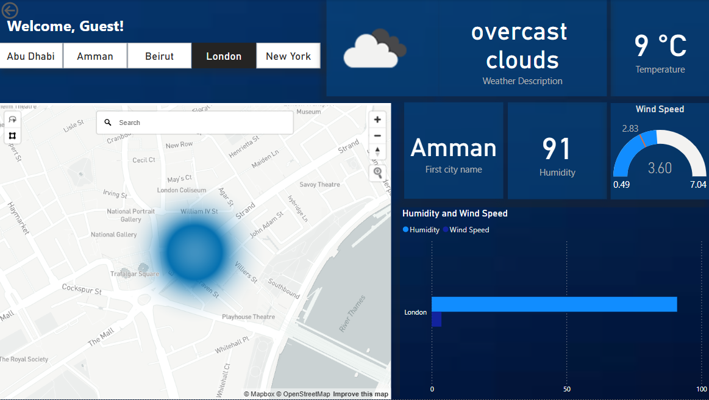
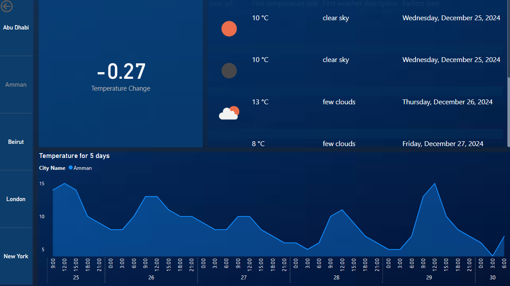

# Weather Forecasting Dashboard - Power BI Project -

## Project Overview
This project demonstrates how to build an **interactive weather forecasting dashboard** using **real-time data from OpenWeatherMap API**.  
Designed for a **travel agency**, the dashboard helps plan trips by showing current weather and 5-day forecasts for multiple cities across the world.

The dashboard includes **API integration**, **data transformation**, and **dynamic visualizations**, showcasing the candidate's skills in handling external data sources and time series analytics.

---

## Data Source
- **API Provider:** [OpenWeatherMap](https://openweathermap.org/api)
- **API Used:**
  - [Current Weather Data API](https://openweathermap.org/current)
  - [5 Day / 3 Hour Forecast API](https://openweathermap.org/forecast5)

## Data Fields Extracted
- `City Name`
- `Temperature` (°C/°F)
- `Humidity` (%)
- `Wind Speed` (m/s)
- `Weather Description` (e.g., clear sky, rain)
- `Date and Time` (for forecast time series)

## Data Connection and Transformation

### 1. Power BI API Integration
- Connected Power BI to the OpenWeatherMap API using a Web connector and parameterized API key
- Queried data for multiple cities: **New York, London, Dubai, Tokyo, etc.**

### 2. JSON Parsing and Cleaning
- Parsed the JSON response using Power Query
- Transformed nested fields into tabular format
- Converted Unix timestamps to DateTime format
- Standardized units for temperature and wind speed

## Analysis Objectives
- **Current Weather Analysis:** Display real-time conditions for selected cities
- **5-Day Forecast:** Show temperature, humidity, and wind speed over time
- **Comparative Weather Analysis:** Compare cities based on current weather metrics

## Visualizations Included

| Visualization Type  | Description |
|----------------------|-------------|
|  KPIs              | For current temperature, humidity, wind speed |
|  Line Charts       | Forecasted temperature trends over 5 days |
|  Bar Charts        | Comparative humidity & wind speed between cities |
|  Card Visuals       | For weather descriptions (e.g., "Rainy", "Clear") |

## User Interactivity
- **Slicers**:
  - City Selector
  - Time Frame (Current, Next 3 Days, Full 5-Day View)
- **Dynamic Titles & Filters**:
  - Adjusts visuals and headers based on user selections
    
## Dashboard Preview
 
 

